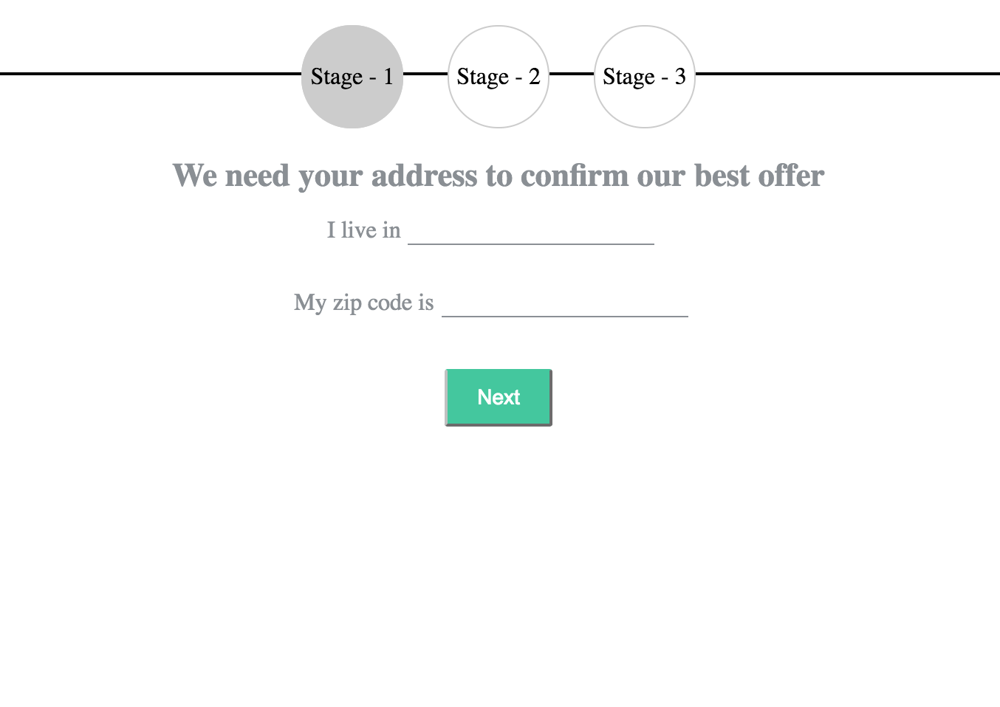
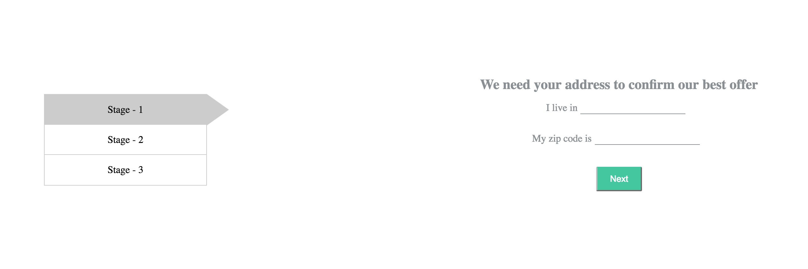

# Questionnaire

## For quick install
```bash
npm install
gulp dev
npm start
```

## 1. Setup
```bash
npm install
```
- install dependencies

## 2. Watch files
```bash
gulp dev
```
- all SCSS/HTML will be watched for changes and injected into browser thanks to BrowserSync

## 3. Build production version
```bash
gulp build
```

## 4. Run unit test
```bash
gulp unit
```

## 5. Start webserver
```bash
npm start
```

## Structure of App
```
app.js
index.html
public/
    lib/
    ico/
    styles/
    template/
src/
    _config/
    modules/
        questions/
            .js
            .scss
            controller/
                .js
            factory/
                .js
            directive/
                .js
            template/.html
```

## first size


## second size
